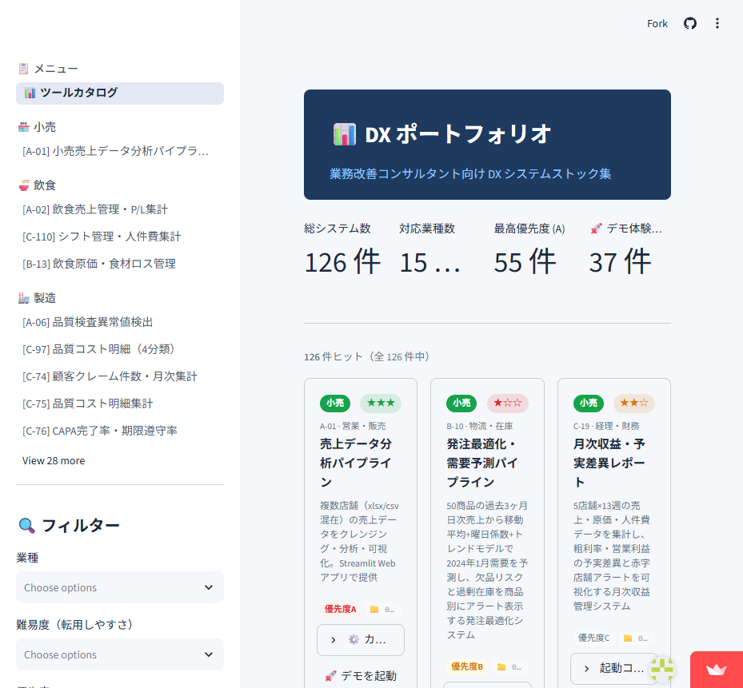
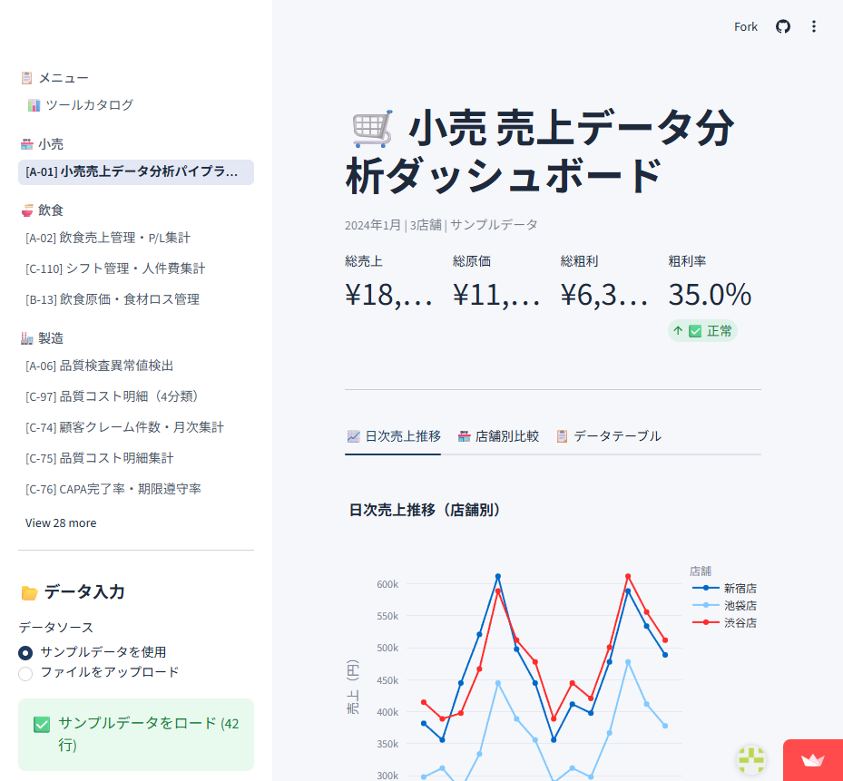

# 📊 DX ポートフォリオ — 業務改善システムストック集

[](https://dx-portfolio-5gwofcythcrqjtmfoewwwj.streamlit.app/)


> **業務改善コンサルタント向け DX システムライブラリ。**  
> ブラウザ上でデモを体験 → `config.yml` を書き換えて即納品。

---

## 🚀 ライブデモ

**👉 [dx-portfolio-5gwofcythcrqjtmfoewwwj.streamlit.app](https://dx-portfolio-5gwofcythcrqjtmfoewwwj.streamlit.app/)**

47 ツールをブラウザで即体験できます。クレカ登録・インストール不要。

---

## 📸 スクリーンショット

### ツールカタログ（130 システムを一覧・フィルタリング）


### ライブデモ例（A-01 小売売上データ分析パイプライン）


---

## 何ができるか

| # | できること | 代表ツール |
|---|-----------|-----------|
| 🏭 | **製造業 QC・設備監視** 不良率・CAPA・特採の集計、設備センサー異常の自動予兆検知 | A-06 品質検査 / B-09 設備稼働ログ |
| 🏪 | **小売 売上分析・発注最適化** xlsx/csv 自動クレンジング→可視化、需要予測で欠品防止 | A-01 売上分析 / B-10 発注最適化 |
| 🍜 | **飲食 P/L・原価管理** 日次売上・粗利・食材ロスを店舗横断で比較 | A-02 飲食売上 / B-13 原価・ロス |
| 📦 | **物流 在庫鮮度・配送コスト** 滞留在庫・入出庫バランスをアラート付きで監視、ルート別コスト効率分析 | A-03 在庫データ鮮度 / B-17 配送コスト |
| 💰 | **金融・費用管理** 出張費上限超過アラート、与信スコアの自動算出・リスク分類、請求書突合・未収金アラート | A-04 出張費集計 / B-11 与信スコア / B-19 請求書突合 |
| 👥 | **勤怠・研修・採用** 残業アラート・研修効果測定、採用チャネル別歩留まり・ファネル分析 | A-05 / C-111 研修効果 / B-20 採用ファネル |
| 🏥 | **医療 ピーク解析・夜勤管理** 患者来院集中度分析、夜勤偏り・疲労リスク者の早期特定 | A-07 患者訪問 / B-16 シフト分析 |
| 🏢 | **不動産 賃貸管理** 空室率・賃料収入・収支を物件横断で可視化 | B-14 賃貸物件管理 |
| 📚 | **教育 退学リスク警戒** スコア・出席率から高リスク受講生を早期特定 | B-12 退学リスク |
| ⚙️ | **サービス 問い合わせ分析** カテゴリ自動分類・対応時間・解決率を担当者別集計 | B-15 問い合わせログ |

**全 15 業種 × 130 システム**をカバー。ライブデモ **47 本**（A 系 8 本・B 系 12 本・C 系 27 本）をブラウザで即体験可能。

---

## 🎯 ターゲットユーザー

- **中小企業 DX コンサルタント** — 顧客ごとに 1 から作らず、ストックから選んでカスタマイズ
- **社内 IT 推進担当** — 部門横断のデータ収集〜可視化を Streamlit ＋ Python で内製化
- **業務改善チーム** — Excel 管理から脱却するための最初の 1 本を探している

---

## ⚡ 5 分でローカル起動

```bash
git clone https://github.com/kazupu2025/dx-portfolio.git
cd dx-portfolio

# ポートフォリオ全体（カタログ表示）
pip install streamlit pyyaml plotly pandas
streamlit run portfolio_app.py

# 個別ツール（例: 小売売上分析）
cd 01_retail/01_sales_analysis
pip install -r ../../requirements.txt
streamlit run app.py
```

---

## 📁 対応業種一覧

| フォルダ | 業種 | 主なツール数 |
|---------|------|------------|
| `01_retail/` | 小売 | 4 |
| `02_manufacturing/` | 製造 | 55 |
| `03_healthcare/` | 医療・介護 | 6 |
| `04_finance/` | 金融・保険 | 5 |
| `05_logistics/` | 物流・倉庫 | 5 |
| `06_restaurant/` | 飲食 | 4 |
| `07_realestate/` | 不動産 | 4 |
| `08_hr/` | 人事・採用 | 6 |
| `09_education/` | 教育・研修 | 4 |
| `10_service/` | サービス・SaaS | 5 |
| `hotel/` `construction/` `agriculture/` `automotive/` | その他 4 業種 | 各 2〜3 |

---

## 🔧 カスタマイズの仕組み

各ツールは **`config.yml` 1 ファイルで主要設定を変更可能**に設計：

```yaml
# 例: 01_retail/01_sales_analysis/config.yml
columns:
  date:     "日付"       # ← 顧客CSVの列名に合わせるだけ
  store:    "店舗名"
  sales:    "売上金額"
  cost:     "原価"
alert_gross_margin_rate: 0.30   # アラートラインも調整可
```

コードを読まずに列名マッピング・閾値・会社名を変更できます。

---

## 🛠 技術スタック

| レイヤー | 採用技術 |
|---------|---------|
| UI | Streamlit 1.58 |
| データ処理 | pandas / numpy |
| 可視化 | Plotly Express |
| 統計・ML | scipy / scikit-learn |
| 設定管理 | PyYAML |
| コード生成 | Claude Code（Anthropic） |

---

## コンセプト

> **作るためのLLM（Claude Code）× 動かすためのPython**

各ツールは Claude Code が Python コードを生成。完成後は LLM なしで動作します。  
カスタマイズ・保守更新には再びエージェントが活躍する「人間とAIの協業」モデルです。

---

## 📞 お問い合わせ

導入・カスタマイズのご相談: [realpooh0927@gmail.com](mailto:realpooh0927@gmail.com)

---

<details>
<summary>🔧 開発者向け情報（クリックして展開）</summary>

### ディレクトリ構造

```
dx-portfolio/
├── portfolio_app.py   カタログ Streamlit アプリ（エントリポイント）
├── catalog.yml        126 システム定義（id / name / industry / priority 等）
├── requirements.txt   共通依存パッケージ
├── PORTFOLIO.md       全システム状態ダッシュボード
├── ROADMAP.md         優先度付きユースケース一覧
├── _template/         新システム作成時の雛形
└── _common/           全システム共通ライブラリ
```

### 新システムの追加手順

```bash
# 1. テンプレートをコピー
cp -r _template/ 02_manufacturing/99_new_system/

# 2. catalog.yml に追記（id / name / industry / priority を設定）

# 3. app.py を実装（config.yml で列名・閾値を外部化する設計を推奨）

# 4. portfolio_app.py の _A_TOOL_DEFS に登録（デモ追加の場合）
```

### システム状態の定義

| アイコン | 状態 | 意味 |
|---------|------|------|
| 💡 | Idea | ユースケース候補として登録済み |
| 📐 | Designing | 設計中・要件整理中 |
| 🔧 | PoC | 試作中・動作確認中 |
| 🧪 | Tested | テスト完了・品質確認済み |
| ✅ | Production-ready | 顧客に納品可能な状態 |
| 🚀 | Deployed | 実際の顧客環境で稼働中 |

</details>
